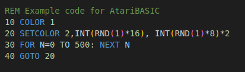

# atari-basic VisualStudioCode extension

A simple AtariBasic support (syntax highlight) for VSC.

Based on fantastic work [AtariBASIC.sublime-syntax](https://github.com/thinkyhead/6502-Tools/blob/master/Sublime/AtariTools/AtariBASIC.sublime-syntax) by [thinkyhead](https://github.com/thinkyhead).

And example of coloring on dark theme:

